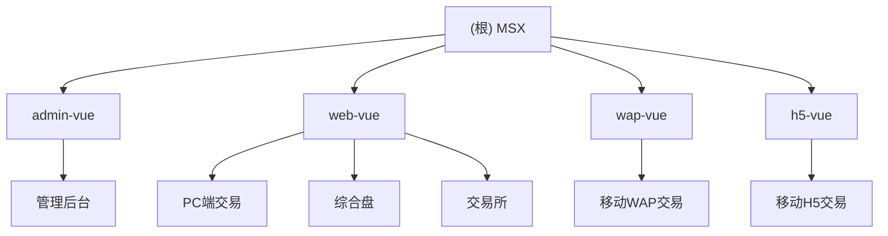

# MSX 项目文档

## 项目愿景

MSX是一个多端金融交易平台，提供包括加密货币、股票、ETF、外汇和大宗商品等多种金融产品的交易服务。该平台支持多种客户端，包括管理后台、Web端、移动端H5和移动端WAP，满足不同用户的需求。

## 架构总览

MSX采用前后端分离的架构，主要包含四个前端应用模块：

1. **admin-vue**：管理后台，用于平台管理
2. **web-vue**：PC端Web应用，支持综合盘和交易所功能
3. **wap-vue**：移动端WAP应用，为移动设备优化的交易界面
4. **h5-vue**：移动端H5应用，轻量级移动交易解决方案

所有前端模块均使用Vue框架构建，通过API与后端服务进行通信，实现数据交互和业务逻辑处理。

## 模块结构图



## 模块索引

| 模块 | 路径 | 主要功能 | 技术栈 |
|-----|------|---------|--------|
| admin-vue | /admin-vue | 管理后台系统，用于平台管理、用户管理、系统配置等 | Vue 2 + Element UI + Avue |
| web-vue | /web-vue | PC端交易界面，支持综合盘和交易所功能，包括股票、加密货币、ETF等交易 | Vue 3 + Element Plus + Vite |
| wap-vue | /wap-vue | 移动端WAP交易界面，为移动设备优化的完整交易功能 | Vue 3 + Vant + Vite |
| h5-vue | /h5-vue | 移动端H5轻量级交易应用，专注于核心交易功能 | Vue 3 + Element Plus + Vite |

## 运行与开发

### 环境要求

- Node.js >= 16.0.0
- npm 或 yarn 或 pnpm

### 快速开始

各模块分别独立运行：

1. **admin-vue**
   ```bash
   cd admin-vue
   yarn install
   yarn serve
   ```

2. **web-vue**
   ```bash
   cd web-vue
   yarn install
   yarn dev
   ```

3. **wap-vue**
   ```bash
   cd wap-vue
   yarn install
   yarn dev
   ```

4. **h5-vue**
   ```bash
   cd h5-vue
   yarn install
   yarn dev
   ```

### 构建部署

```bash
# 各模块分别构建
yarn build
```

## 测试策略

- **代码检查**：各模块使用ESLint进行代码规范检查
- **兼容性测试**：支持现代浏览器，部分模块支持IE11
- **响应式测试**：wap-vue和h5-vue专注于移动端适配
- **多语言测试**：支持多语言国际化

## 编码规范

- 使用ESLint进行代码规范检查
- 组件命名采用PascalCase
- 文件命名采用kebab-case
- 使用SCSS/Less进行样式编写
- 使用Pinia/Vuex进行状态管理

## AI 使用指引

- 当需要修改多个模块共同功能时，请先了解各模块间的差异
- 各模块有独立的API服务层，修改API时需要考虑兼容性
- 模块间共享的业务逻辑需要保持一致
- 新增功能时需要考虑在所有端口的实现

## 变更记录 (Changelog)

- 2025-11-29：初始化项目文档，添加模块结构和索引
- 在md文档中有之前开发留下来的文档记录，也是很重要的信息，你遇到问题可以查看。