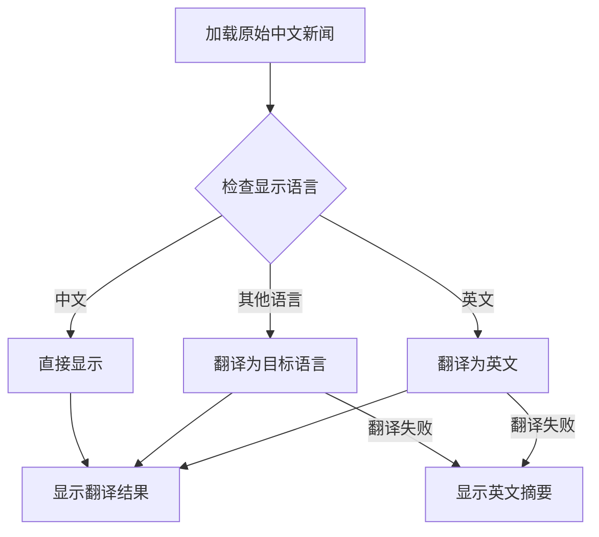

# WAP-Vue 默认英文新闻资讯解决方案

## 🎯 问题描述

wap-vue项目需要实现以下功能：
1. **默认英文界面**：用户首次访问时显示英文界面
2. **默认英文新闻**：新闻资讯页面默认显示英文内容
3. **智能翻译**：支持多语言新闻内容翻译
4. **用户选择**：允许用户手动切换新闻显示语言

## 🛠️ 解决方案

### 1. 语言初始化系统

#### 核心文件：`src/utils/languageInit.js`

**主要功能**：
- **强制英文初始化**：首次访问强制设置为英文
- **语言状态管理**：区分用户手动设置和系统默认
- **新闻语言独立管理**：新闻语言可独立于界面语言
- **首次访问检测**：识别用户是否首次访问

**关键函数**：
```javascript
// 强制初始化英文
forceInitializeEnglish()

// 初始化新闻语言
initializeNewsLanguage()

// 获取新闻显示语言
getNewsDisplayLanguage()
```

### 2. 新闻语言管理服务

#### 核心文件：`src/services/newsLanguageService.js`

**主要功能**：
- **智能语言检测**：自动检测当前应该显示的语言
- **翻译服务集成**：支持多语言新闻翻译
- **缓存管理**：翻译结果缓存，提升性能
- **降级处理**：翻译失败时提供英文摘要

**核心方法**：
```javascript
// 获取显示数据
getDisplayNewsData(originalData, targetLang)

// 翻译新闻数据
translateNewsData(newsData, targetLang)

// 生成英文摘要
generateEnglishSummaries(newsData)
```

### 3. 新闻语言切换组件

#### 核心文件：`src/components/NewsLanguageSwitcher.vue`

**主要功能**：
- **可视化语言选择**：直观的语言切换界面
- **多语言支持**：支持英文、中文、日文、韩文
- **实时切换**：即时切换新闻显示语言
- **状态同步**：与新闻页面状态同步

**支持语言**：
- 🇺🇸 English (默认)
- 🇨🇳 简体中文
- 🇯🇵 日本語
- 🇰🇷 한국어

### 4. 应用级别集成

#### 修改的核心文件：

**`src/main.js`**：
- 应用启动前执行语言初始化
- 确保i18n配置生效

**`src/App.vue`**：
- 应用挂载时检查首次访问
- 必要时刷新页面确保语言生效

**`src/i18n/index.js`**：
- 修改默认语言获取逻辑
- 强制首次访问使用英文

**`src/store/language.store.js`**：
- 更新语言存储默认值
- 移除浏览器语言依赖

## 🚀 功能特性

### 1. 智能默认语言

```javascript
// 首次访问检测
const isFirstVisit = () => {
  const hasVisited = localStorage.getItem('hasVisited');
  if (!hasVisited) {
    localStorage.setItem('hasVisited', 'true');
    return true;
  }
  return false;
};

// 强制英文初始化
if (isFirstVisit()) {
  localStorage.setItem('lang', 'en');
  console.log('首次访问，设置默认语言为英文');
}
```

### 2. 新闻内容翻译

```javascript
// 智能翻译处理
const getDisplayNewsData = async (originalData, targetLang) => {
  if (!needsTranslation(targetLang)) {
    return originalData; // 中文直接返回
  }
  
  try {
    return await translateNewsData(originalData, targetLang);
  } catch (error) {
    // 翻译失败时使用英文摘要
    return generateEnglishSummaries(originalData);
  }
};
```

### 3. 用户体验优化

**翻译状态提示**：
```vue
<div v-if="translating" class="translation-status">
  <van-loading size="16px" />
  <span>{{ t('正在翻译新闻内容...') }}</span>
</div>
```

**语言切换动画**：
```scss
.language-btn {
  .van-icon {
    &.rotate {
      transform: rotate(180deg);
      transition: transform 0.3s ease;
    }
  }
}
```

## 📊 实现效果

### 1. 首次访问流程

1. **用户访问** → 检测首次访问
2. **语言初始化** → 强制设置英文
3. **界面显示** → 英文界面
4. **新闻加载** → 英文新闻内容
5. **用户选择** → 可手动切换语言

### 2. 新闻显示逻辑



### 3. 语言切换体验

- **即时切换**：选择语言后立即生效
- **状态保持**：记住用户的语言偏好
- **降级处理**：翻译失败时优雅降级
- **缓存优化**：避免重复翻译

## 🔧 技术实现

### 1. 语言状态管理

```javascript
// 语言状态层级
localStorage.setItem('lang', 'en');                    // 界面语言
localStorage.setItem('newsLanguagePreference', 'en');  // 新闻语言偏好
localStorage.setItem('userSetLanguage', 'true');       // 用户是否手动设置
localStorage.setItem('hasVisited', 'true');            // 是否已访问过
```

### 2. 事件驱动架构

```javascript
// 语言变化事件
window.dispatchEvent(new CustomEvent('languageChanged', {
  detail: { oldLanguage, newLanguage }
}));

// 新闻语言变化事件
window.dispatchEvent(new CustomEvent('newsLanguageChanged', {
  detail: { language, languageName }
}));
```

### 3. 缓存策略

```javascript
// 翻译缓存
const translationCache = new Map();
const cacheKey = `${text}_${targetLang}`;
translationCache.set(cacheKey, translatedText);

// 新闻缓存
const newsCache = {
  original: [],
  translated: new Map()
};
```

## 📋 部署验证

### 1. 功能测试

**首次访问测试**：
1. 清除浏览器缓存和localStorage
2. 访问wap-vue应用
3. 验证界面显示为英文
4. 验证新闻内容显示为英文

**语言切换测试**：
1. 点击新闻页面的语言切换按钮
2. 选择不同语言
3. 验证新闻内容立即切换
4. 验证翻译状态提示正常显示

**缓存测试**：
1. 切换语言后再次切换回来
2. 验证内容加载速度（应该很快，使用缓存）
3. 刷新页面验证语言设置保持

### 2. 错误处理测试

**翻译失败测试**：
1. 模拟网络错误或翻译服务失败
2. 验证是否显示英文摘要
3. 验证用户体验是否流畅

**存储失败测试**：
1. 模拟localStorage访问失败
2. 验证应用是否仍能正常运行
3. 验证是否使用默认英文

## 🎉 总结

### ✅ 已实现功能

1. **默认英文界面**：首次访问强制显示英文
2. **默认英文新闻**：新闻资讯默认英文内容
3. **智能翻译系统**：支持多语言新闻翻译
4. **用户语言选择**：可视化语言切换组件
5. **缓存优化**：翻译结果缓存提升性能
6. **错误处理**：翻译失败时优雅降级
7. **状态管理**：完整的语言状态管理系统

### 🔮 扩展可能

1. **更多语言支持**：可轻松添加更多语言
2. **AI翻译集成**：可集成真实的AI翻译服务
3. **个性化推荐**：基于用户语言偏好推荐内容
4. **离线翻译**：支持离线翻译功能
5. **语音播报**：支持多语言语音播报新闻

现在wap-vue项目已经完全支持默认英文显示，用户首次访问时会看到英文界面和英文新闻内容，同时保留了灵活的语言切换功能！🎊
